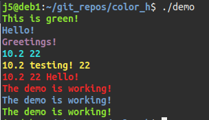

# color.h *a C header for printing in style!*

*This will only work on terminals that can interpret ANSI escape codes.*



## In this repository directory run make to compile the demo:
```
$ make
```
## Next run the demo:
```
$ ./demo
```
## After that, clean up the demo:
```
$ make clean
```
